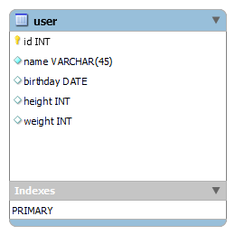
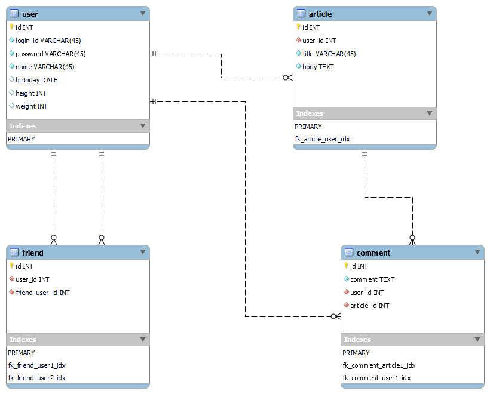

# EngineersGate SQLオリジナル課題

SQLオリジナル課題制作物になります。

## 目的

SQLオリジナル課題制作物として、下記課題を行いました。

### 1. MySQLをインストールしましょう
### 2. MySQLに接続してみましょう
### 3. データベースを作成しましょう
```sql
/* 3.データベース作成 */
CREATE SCHEMA `test_db` ;
```

### 4. テーブルを作成しましょう
```sql
/* 4.テーブル作成 */
CREATE TABLE `test_db`.`user` (
  `id` INT NOT NULL,
  `name` VARCHAR(45) NOT NULL COMMENT '名前',
  `birthday` DATE NULL COMMENT '誕生日',
  `height` INT NULL COMMENT '身長',
  `weight` INT NULL COMMENT '体重',
  PRIMARY KEY (`id`));
```

### 5. 作成したテーブルにレコードの登録・更新・削除を行ってみましょう
```sql
/* 5.レコード登録・更新・削除 */
INSERT INTO `test_db`.`user` (`id`, `name`, `birthday`, `height`, `weight`) VALUES ('1', '山田 太郎', '2000-12-21', '170', '65');
INSERT INTO `test_db`.`user` (`id`, `name`, `birthday`, `height`, `weight`) VALUES ('2', '山田 太郎', '2001-01-01', '175', '70');
INSERT INTO `test_db`.`user` (`id`, `name`, `birthday`, `height`, `weight`) VALUES ('3', '山田 太郎', '2002-01-21', '160', '50');

UPDATE `test_db`.`user` SET `name` = '山田 次郎' WHERE (`id` = '2');
UPDATE `test_db`.`user` SET `name` = '山田 花子' WHERE (`id` = '3');
UPDATE `test_db`.`user` SET `weight` = '75' WHERE (`id` = '1');

DELETE FROM `test_db`.`user` WHERE (`id` = '3');
```

### 6. MySQL Workbenchをインストールしましょう
### 7. MySQL Workbenchで、作成したデータベースに接続しましょう
### 8. MySQL Workbenchで、ER図を作成してみましょう


### 9. 作成したER図よりCreate文を生成してみましょう
```sql
CREATE TABLE IF NOT EXISTS `test_db`.`user` (
  `id` INT NOT NULL COMMENT 'ID',
  `name` VARCHAR(45) NOT NULL COMMENT '名前',
  `birthday` DATE NULL COMMENT '誕生日',
  `height` INT NULL COMMENT '身長',
  `weight` INT NULL COMMENT '体重',
  PRIMARY KEY (`id`))
ENGINE = InnoDB
COMMENT = 'ユーザー'
```

### 10. MySQL WorkbenchでSNSサイトを作成する上で必要なテーブル構成を設計（ER図を作成する）してみましょう


